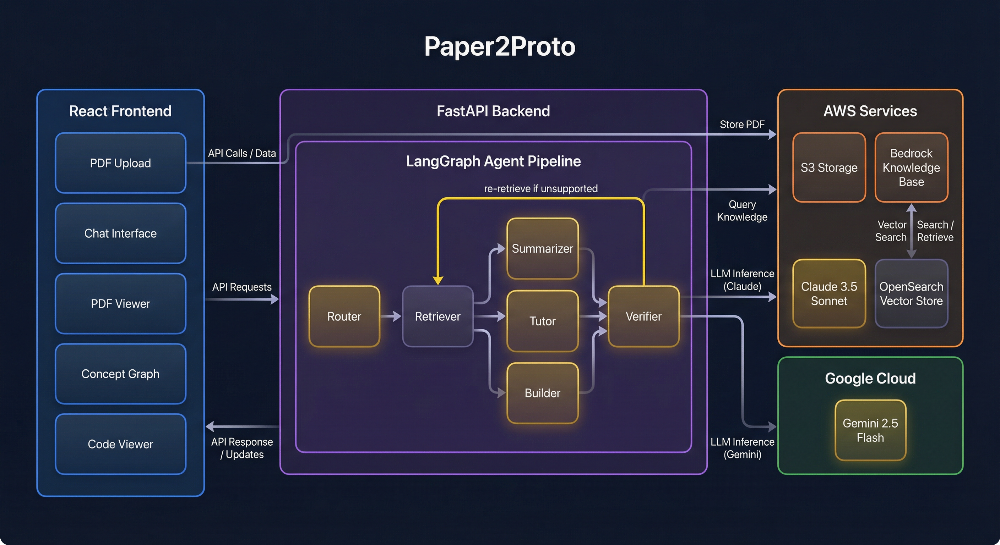
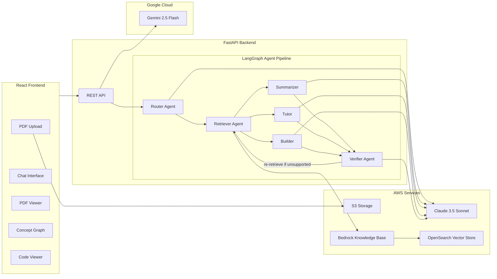

# Paper2Proto

> AI-powered platform that turns research papers into interactive, queryable knowledge bases with citation-backed answers, code extraction, and concept visualization.

**Built at HackNC State** | [GitHub](https://github.com/Abhinav-Avasarala/HackNCState-paper2proto)

---

## Problem

Reading and extracting actionable insights from dense research papers is time-consuming. Researchers and engineers often need to understand key concepts, replicate implementations, or quickly grasp a paper's contributions -- tasks that demand deep, repeated reading.

## Solution

Paper2Proto lets users upload any academic PDF and immediately interact with it through natural language. The system retrieves relevant passages, generates verified answers with inline citations, extracts runnable code snippets, and visualizes concept relationships -- all backed by a self-verifying multi-agent pipeline.

## Architecture

Mermaid source (click to expand)

The backend orchestrates a **6-agent LangGraph pipeline**:

1. **Router** classifies each query (summary, Q&A, code extraction, mixed) and plans retrieval targets.
2. **Retriever** performs semantic search against a Bedrock Knowledge Base backed by OpenSearch, returning up to 15 deduplicated evidence chunks.
3. **Producer** (one of Summarizer, Tutor, or Builder) generates the response grounded in retrieved evidence.
4. **Verifier** fact-checks every claim against the evidence. If claims are unsupported, it triggers re-retrieval (up to 2 correction loops) before delivering the final answer.

## Key Technical Highlights

- **Multi-Agent RAG Pipeline** -- 6 specialized agents orchestrated via LangGraph with conditional routing and self-correction loops, going beyond simple retrieve-and-generate patterns.
- **Self-Verification Loop** -- A dedicated Verifier agent fact-checks every response against retrieved evidence, labeling claims as `SUPPORTED`, `WEAKLY_SUPPORTED`, `UNSUPPORTED`, or `CONTRADICTED` and triggering re-retrieval when needed. This directly addresses LLM hallucination at the architecture level.
- **Code Extraction Engine** -- The Builder agent extracts implementable code snippets (10-50 lines) from papers, complete with language detection, explanations, paper-basis citations, and tracked assumptions.
- **Interactive Citation System** -- Clickable `[Chunk N]` citations in chat responses that highlight and scroll to the exact passage in a side-by-side PDF viewer.
- **Concept Graph Visualization** -- Force-directed graph powered by d3-force that dynamically maps a paper's key concepts, methods, results, and applications and their relationships.
- **AI Image Generation** -- Gemini 2.5 Flash generates visual representations of paper concepts on demand.

## Tech Stack

| Layer | Technologies |
|-------|-------------|
| **Frontend** | React 18, react-pdf, react-force-graph-2d, react-markdown, d3-force |
| **Backend** | Python, FastAPI, LangGraph, LangChain |
| **AI / ML** | AWS Bedrock (Claude 3.5 Sonnet), Google Gemini 2.5 Flash, OpenSearch (vector search) |
| **Cloud** | AWS S3, AWS Bedrock Knowledge Base, AWS Bedrock Runtime |
| **Patterns** | RAG, Multi-Agent Systems, Self-Verification, Agentic AI |

## How It Works

1. **Upload** -- Drop a research paper PDF (up to 50 MB). It is stored in S3 and ingested into a Bedrock Knowledge Base for vector search.
2. **Ask** -- Query the paper in natural language. The Router agent classifies your intent and the Retriever fetches the most relevant passages.
3. **Read** -- Get a verified, citation-backed answer. Click any `[Chunk N]` citation to jump to the exact passage in the PDF viewer.
4. **Extract** -- Request code implementations. The Builder agent pulls algorithms and methods from the paper into runnable snippets with explanations.
5. **Explore** -- Open the Evidence Board to see a force-directed concept graph mapping the paper's ideas and their connections.
